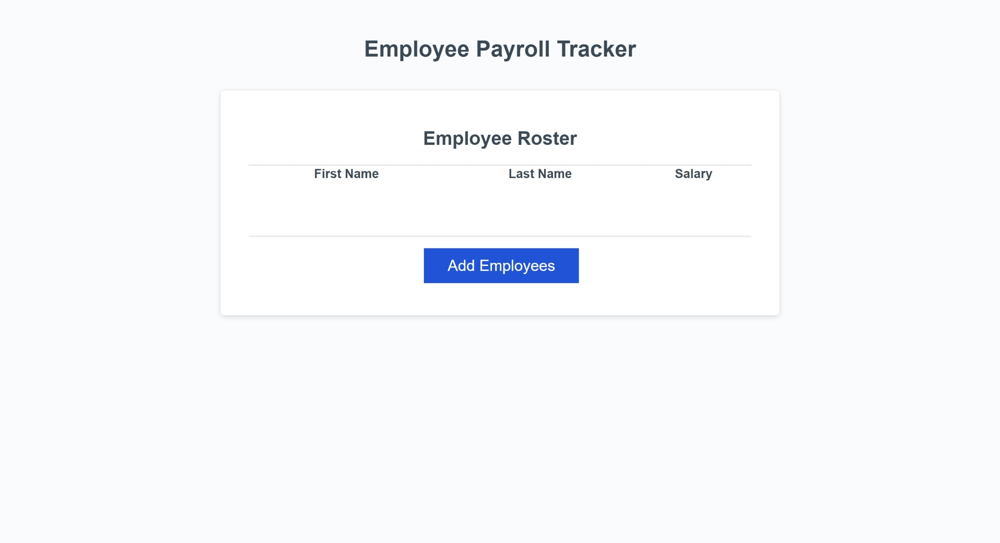
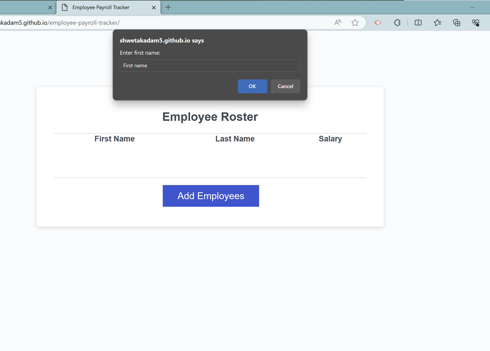
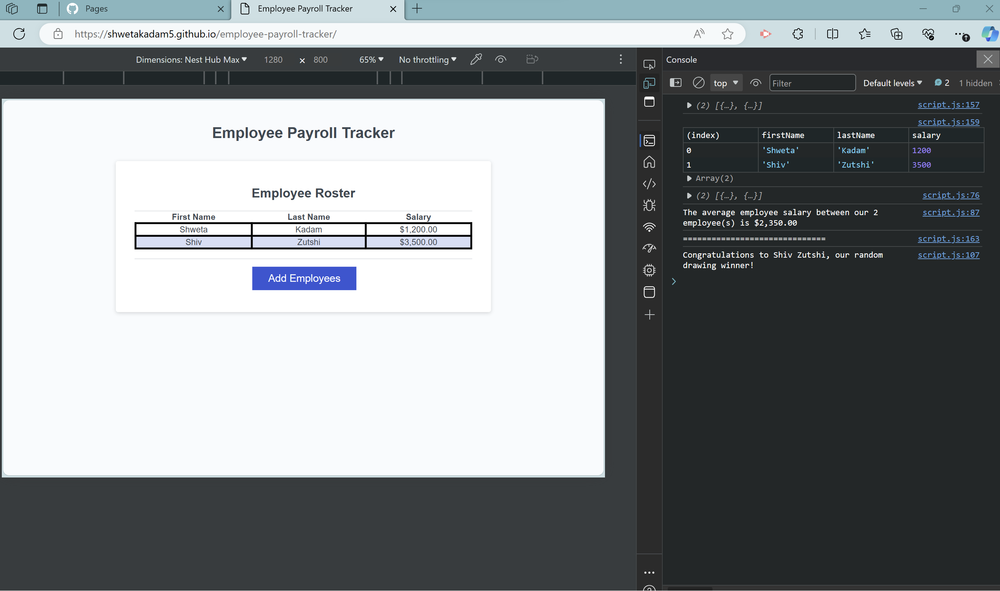
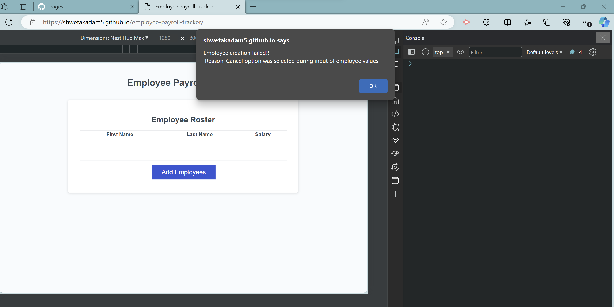
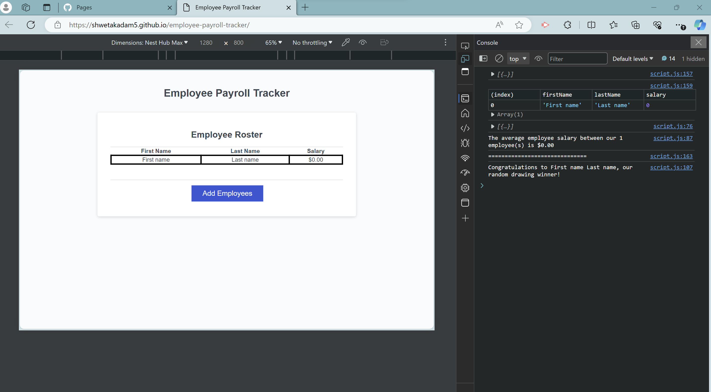

# Employee payroll tracker application

## Description


- The employee payroll tracker application enables a payroll manager to view and manage payroll data. 
- The starter code was modified to ensure that the employee data are added by the user with an option to choose when to stop.
- Once the user inputs the details for the employees to be added, the list of employees is dynamically updated on the html , the average salary of the employees and a random winner from the employee list is displayed on the console using javascript coding. 
- This application helped implement the knowledge of javascripts, arrays, functions, variables, conditional statements, operators and console logging.

## Table of Contents (Optional)

If your README is long, add a table of contents to make it easy for users to find what they need.

- [Installation](#installation)
- [Usage](#usage)
- [Credits](#credits)
- [License](#license)


## Installation

Follow these instructions to create your project and deploy it to GitHub Pages:

1. Create a new repository on your GitHub account and clone it to your computer.

2. When you're ready to deploy, use the git add, git commit, and git push commands to save and push your code to your GitHub repository.

3. Navigate to your GitHub repository in the browser and then select the Settings tab on the right side of the page.

4. On the Settings page, select Pages on the left side of the page. On the GitHub Pages screen, choose main in the dropdown under Branch. Click the Save button.

5. Navigate to <your-github-username.github.io/your-repository-name> and you will find that your new webpage has gone live! For example, if your GitHub username is "lernantino" and the project is "css-demo-site", then your URL would be <lernantino.github.io/css-demo-site>.


## User Story

```md
AS A payroll manager
I WANT AN employee payroll tracker
SO THAT I can see my employees' payroll data and properly budget for the company
```

## Usage

- Once the website is live, the following webpage should be displayed to the user :


- The User Input Prompt with default input text :



- Once the user has added the employees the following shows the expected results page



## Acceptance Criteria

```md
GIVEN an employee payroll tracker
WHEN I click the "Add employee" button
THEN I am presented with a series of prompts asking for first name, last name, and salary
WHEN I finish adding an employee
THEN I am prompted to continue or cancel
WHEN I choose to continue
THEN I am prompted to add a new employee
WHEN I choose to cancel
THEN my employee data is displayed on the page sorted alphabetically by last name, and the console shows computed and aggregated data
```


## Tests

**Test 1** : 
- Click on the Add Employees button: 
        A dialog box will be displayed that prompts user for an input "Enter first name:" 
        The user input will have a default input text "First name"
        OK button and Cancel button

- Click on OK button of Enter first name dialog box :
        A dialog box will be displayed that prompts user for an input "Enter last name:" 
        The user input will have a default input text "Last name"
        OK button and Cancel button

- Click on OK button of Enter last name dialog box:
        A dialog box will be displayed that prompts user for an input "Enter salary:" 
        The user input will have a default input text "0"
        OK button and Cancel button

- Click on OK button of Enter salary dialog box:
        A dialog box will be displayed that prompts user "Do you want to add another employee?"        
        OK button and Cancel button

- Click on OK button of Do you want to add another employee dialog box:
        A dialog box will be displayed that prompts user for an input "Enter first name:" and so forth


- Click on Cancel button of Do you want to add another employee dialog box:
        All the employees added by the user are dynamically displayed on the Employee roster section of the webpage.
        The employees are sorted by the last name
        The console displays the average salary of the all the added employees
        A random winner is selected from the added employees and displayed on the console.


- Click on Cancel button of the either or all Input Prompts of First name, Last name and Salary :
        A alert box with an error message is displayed and the Employee details are not added : as shown in the screenshot.
        On OK : A dialog box will be displayed that prompts user "Do you want to add another employee?" 

  


- All the dialogs for user input have default text displayed, which can be updated by the user. If the user retains the default values and proceeds to add employee the expected values will be as in the screeenshot.
If no values are provided then the defaulted values are First name, Last name and salary will be defaulted to $0.


- Click on the link Social Media Marketing : User will be navigated to the details of Social Media Marketing on the webpage.

**Test 2** : Hovering on the navigation links will display appropriate text.
- Hover on the link Search Engine Optimization : Hover text will display "Click to visit Search Engine Optimization"
- Hover on the link Online Reputation Management : Hover text will display "Click to visit Online Reputation Management"
- Hover on the link Social Media Marketing : Hover text will display "Click to visit Social Media Marketing"

**Test 3** :
- Hover on the images : Hover text will display the title of the respective image.

**Test 4** : 
- Check if appropriate alt text is displayed if the image fails to load for some reason.

**Test 5**: 
- Check appropriate headers are displayed for every section.

**Test 6** : 
- Check the title of the webpage upon loading.


## License

MIT


